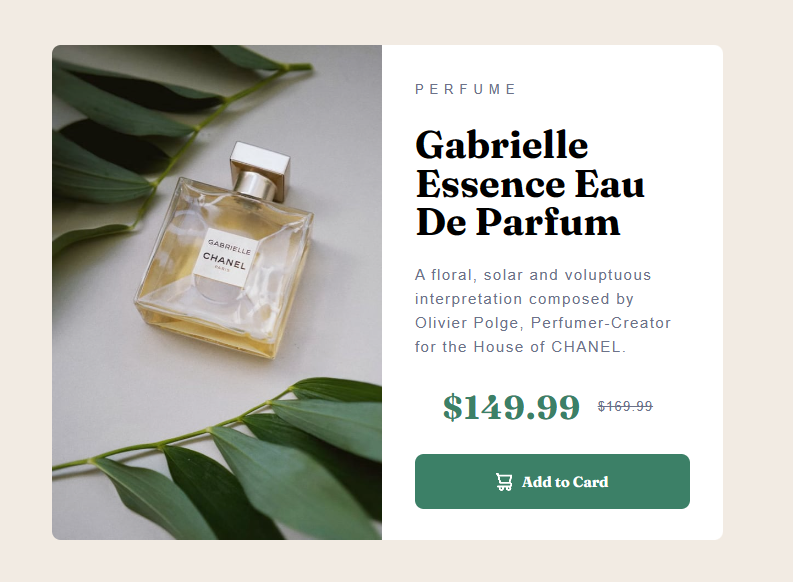

<h1 align="center"> Project-Card </h1>

Desafio para iniciantes em programação com HTML E CSS básico  

  

## 🚀 Tecnologias

Esse projeto foi desenvolvido com as seguintes tecnologias:

- HTML e CSS
- Git e Github

 Para acessar o projeto finalizado acesse em: https://viniciusgcampanella.github.io/productcardpreview/ 
